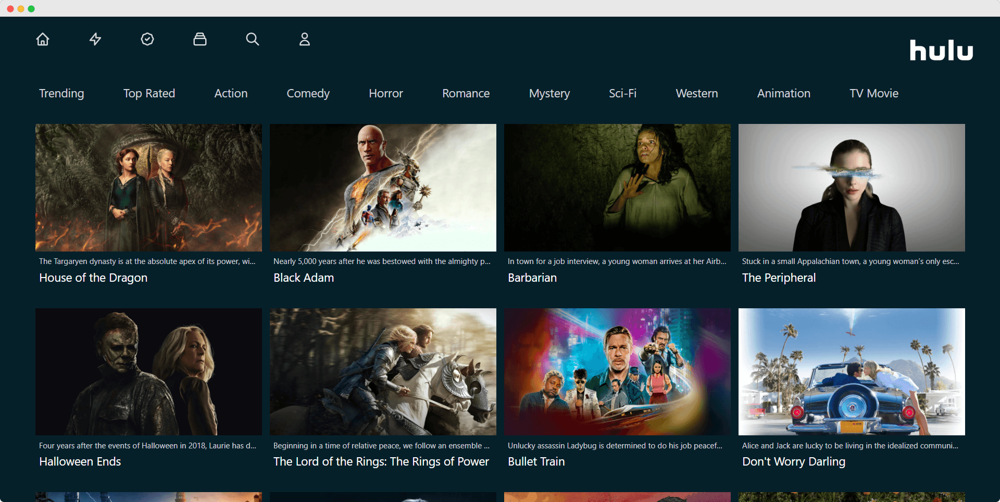

<a name="readme-top"></a>

[![License][license-shield]][license-url]

<div align="center">

  <h1 align="center">Hulu Clone</h1>
  
  <p align="center">
A hulu UI clone that scrapes movie data from TMDB and displays different genres of movies, like trending, most viewed, etc.
    <br />
    <a href="https://hulu.bhavyansh.codes/"><i>View Demo</i></a>
  </p>
</div>

<br/>

<!-- TABLE OF CONTENTS -->
<details>
  <summary>Table of Contents</summary>
  <ol>
    <li>
      <a href="#about">About</a>
      <ul>
        <li><a href="#built-with">Built With</a></li>
      </ul>
    </li>
    <li>
      <a href="#getting-started">Getting Started</a>
      <ul>
        <li><a href="#prerequisites">Prerequisites</a></li>
        <li><a href="#installation">Installation</a></li>
      </ul>
    </li>
    <li><a href="#usage">Usage</a></li>
    <li><a href="#contributing">Contributing</a></li>
    <li><a href="#license">License</a></li>
    <li><a href="#contact">Contact</a></li>
  </ol>
</details>

<!-- ABOUT THE PROJECT -->

### About

A hulu UI clone that scrapes movie data from TMDB and displays different genres of movies, like trending, most viewed, etc

#### Built With

- [![nextjs][next.js]][nextjs-url]
- [![reactjs][react.js]][reactjs-url]
- [![tailwindcss][tailwindcss]][tailwindcss-url]

<p align="right">(<a href="#readme-top">back to top</a>)</p>

<!-- GETTING STARTED -->

## Getting Started

This is how you may set up your project locally.
To get a local copy up and running follow these simple steps.

### Prerequisites

You must have the following installed on your local machine.

- npm package manager
- yarn `npm install --global yarn`

### Installation

1. Fork the repo
2. Clone it to your local computer
   ```sh
   git clone https://github.com/your_username_/Project-Name.git
   ```
3. Install NPM packages using yarn
   ```sh
   yarn
   ```
4. Enter your Environment variables in `.env.local` file
   ```sh
   API_KEY= Get it from https://www.themoviedb.org/settings/api
   ```
5. Run the development server:
   ```bash
   yarn dev
   ```
6. Open [http://localhost:3000](http://localhost:3000) with your browser to see the result.

<p align="right">(<a href="#readme-top">back to top</a>)</p>

<!-- USAGE EXAMPLES -->

## Usage

1. Home page

   

<p align="right">(<a href="#readme-top">back to top</a>)</p>

<!-- CONTRIBUTING -->

## Contributing

Contributions are what make the open source community such an amazing place to learn, inspire, and create. Any contributions you make are **greatly appreciated**.

If you have a suggestion that would make this better, please fork the repo and create a pull request. You can also simply open an issue with the tag "enhancement".
Don't forget to give the project a star! Thanks again!

1. Fork the Project
2. Create your Feature Branch (`git checkout -b feature/AmazingFeature`)
3. Commit your Changes (`git commit -m 'Add some AmazingFeature'`)
4. Push to the Branch (`git push origin feature/AmazingFeature`)
5. Open a Pull Request

<p align="right">(<a href="#readme-top">back to top</a>)</p>

<!-- LICENSE -->

## License

Distributed under the MIT License. See [LICENSE](LICENSE) for more information.

<p align="right">(<a href="#readme-top">back to top</a>)</p>

<!-- CONTACT -->

## Contact

Twitter - [@BhavyanshJain](https://twitter.com/Bhavyansh_Jain_)

Project Link: [https://github.com/BhavyanshJain/hulu-ui-clone](https://github.com/BhavyanshJain/hulu-ui-clone)

<p align="right">(<a href="#readme-top">back to top</a>)</p>

<!-- MARKDOWN LINKS & IMAGES -->

[license-shield]: https://img.shields.io/github/license/BhavyanshJain/hulu-ui-clone
[license-url]: https://github.com/BhavyanshJain/hulu-ui-clone/blob/master/LICENSE
[next.js]: https://img.shields.io/badge/Next.js-000000?style=for-the-badge&logo=nextdotjs&logoColor=white
[nextjs-url]: https://nextjs.org/
[react.js]: https://img.shields.io/badge/React.js-20232A?style=for-the-badge&logo=react&logoColor=61DAFB
[reactjs-url]: https://reactjs.org/
[tailwindcss]: https://img.shields.io/badge/TailwindCSS-06B6D4?style=for-the-badge&logo=tailwindcss&logoColor=white
[tailwindcss-url]: https://tailwindcss.com/
